# 第一章 最优化理论基础

最优化的理论基础主要包含高数相关的内容和和线性代数相关的内容。不过在复习这些基础知识之前还要先明白最优化是什么，最优化是干什么的以及最优化的分类。所以本章主要设计的内容有两个，最优化的基本概念和数学预备知识。

* [最优化方法的基本概念](#最优化方法的基本概念)
* [数学预备知识](#数学预备知识)
   * [向量和范数](#向量与范数)
   * [多元函数的微分](#多元函数的微分)
   * [凸集与凸函数](#凸集与凸函数)
   * [局部极小点与全局极小点](#局部极小点与全局极小点)
   * [鞍点](#鞍点)
   * [优化的必要条件](#优化的必要条件)
   * [优化的充分条件](#优化的充分条件)

## 最优化方法的基本概念

1. 什么是最优化？
   
   1. 最优化就是在复杂环境中遇到的许多决策中，挑选最优决策的一门科学

2. 什么是最优化方法？
   
   1. 最优化方法就是寻找最优决策的方法

3. 一般最优化问题的表达式？
   
   1. 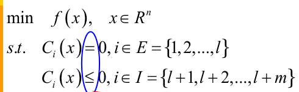
   2. 也就是有约束条件和目标函数，一般都是求目标函数的最小值，如果是情况是需要最大值，通常会加符号之后求最小值。

4. 最优化问题的分类
   
   1. 线性规划
   
   2. 非线性规划
   
   3. 无约束最优化问题
   
   4. 其他优化方法
      
      1. 连续型
         
         1. 线性规划
            
            1. 有约束
         
         2. 非线性规划
            
            1. 无约束
      
      2. 离散型
         
         1. 整数规划
         
         2. 动态规划
      
      3. 其他
         
         1. 随机优化
         
         2. 多目标优化
         
         3. 博弈论

5. 本门课程涉及到的内容
   
   1. 理解基本的最优化概念和优化方法
   
   2. 利用软件实现测试这些方法

## 数学预备知识

### 向量与范数

各阶范数的定义：

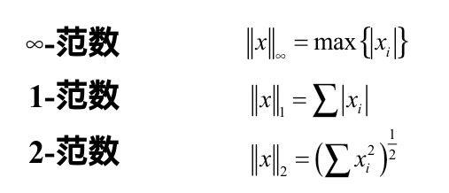

- 范数就是描述“大小”的一个量，一范数可以看成是二维平面上只能横平竖直着走，类似于城市交通当中不能横穿建筑物。
- 二范数就是勾股定理的距离，也就是直线距离
- 无穷范数的直观理解还没有想出来

范数满足的条件：

1. 非负性：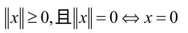

2. 齐次性：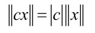

3. 三角不等式：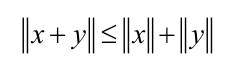

- 记忆这些性质可以根据二范数这一特殊的范数的性质来辅助记忆。

### 多元函数的微分

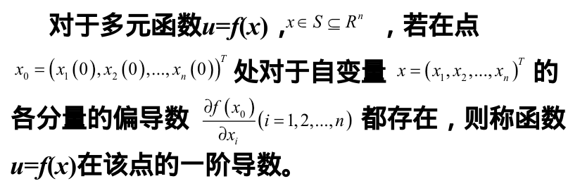

#### （1）梯度

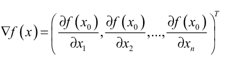

#### （2）Hession矩阵

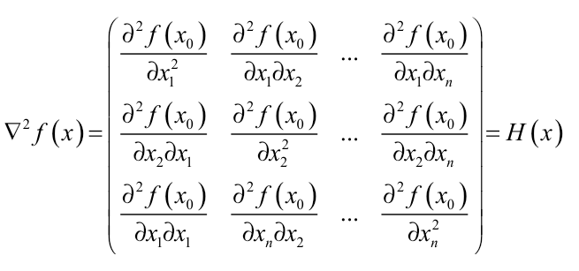

### 凸集与凸函数

#### （1）凸集

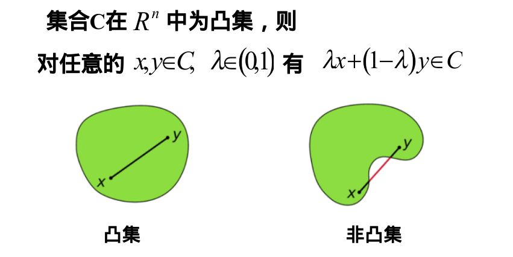

- 集合内两点之间的点也在集合内

#### （2）超平面

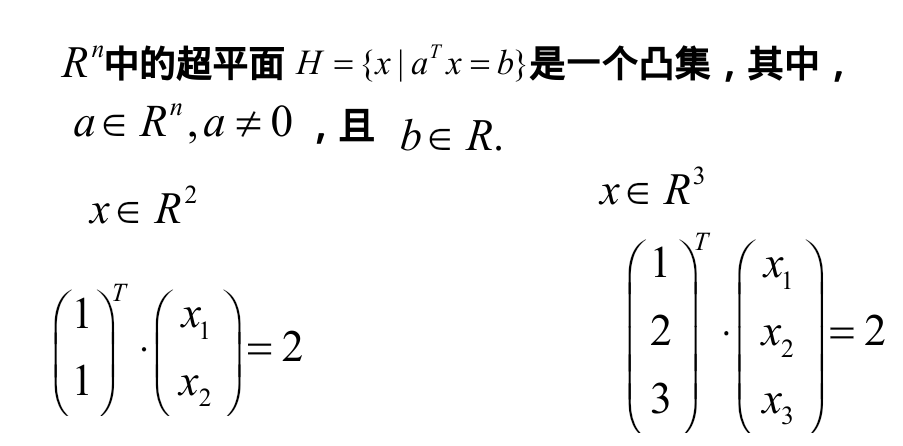

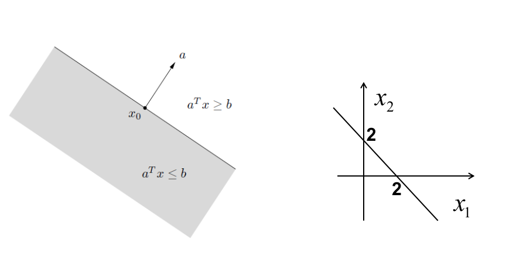

- 平面中超平面就是一条线
- 空间中超平面就是一个面

#### （3）支撑超平面

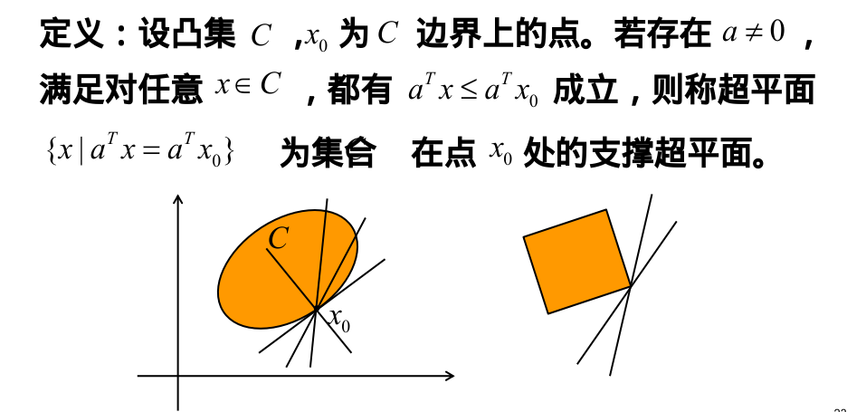

- 类似于圆的切线定义的扩展

#### （4）凸函数的定义

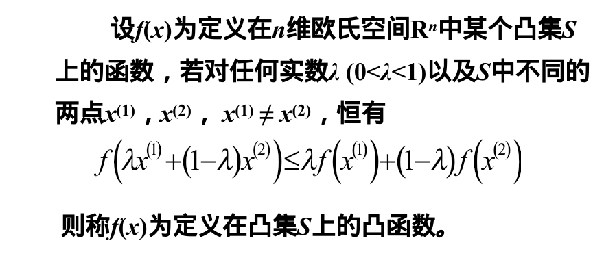

- 函数值的线性组合大于自变量线性组合的函数值

**任意两点的函数值的连线上的点都在曲线的上方**

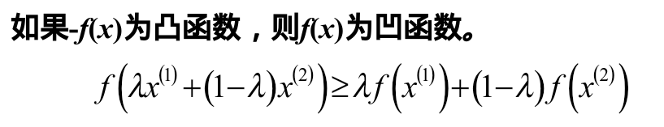

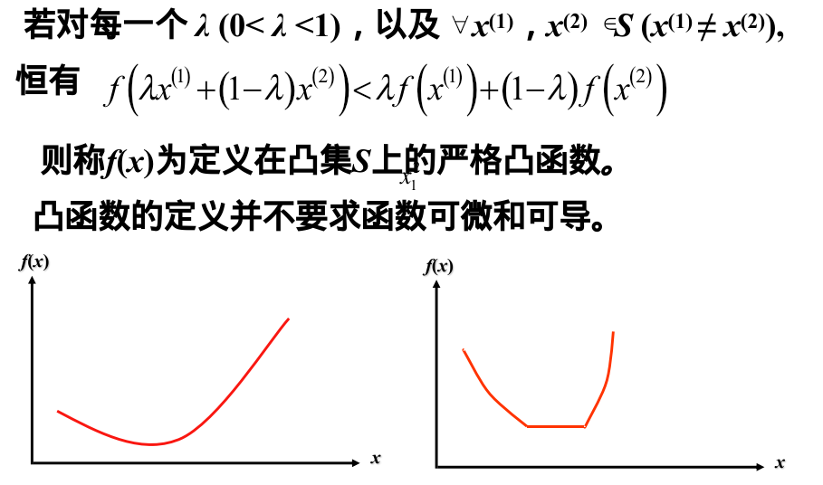

- 凹函数就是凸函数反过来

#### （5）凸函数的判定准测

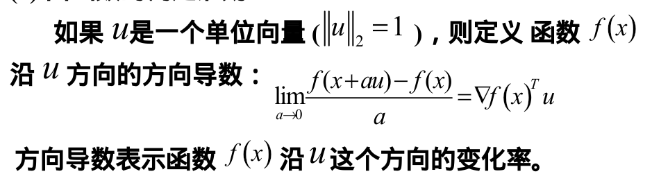

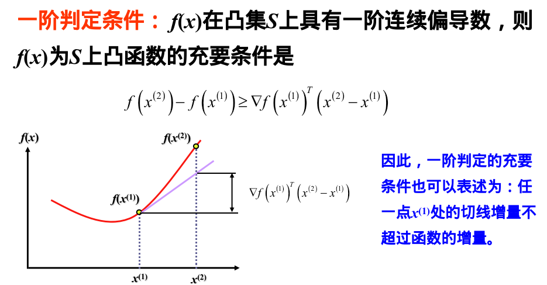

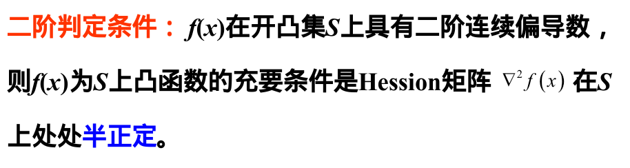

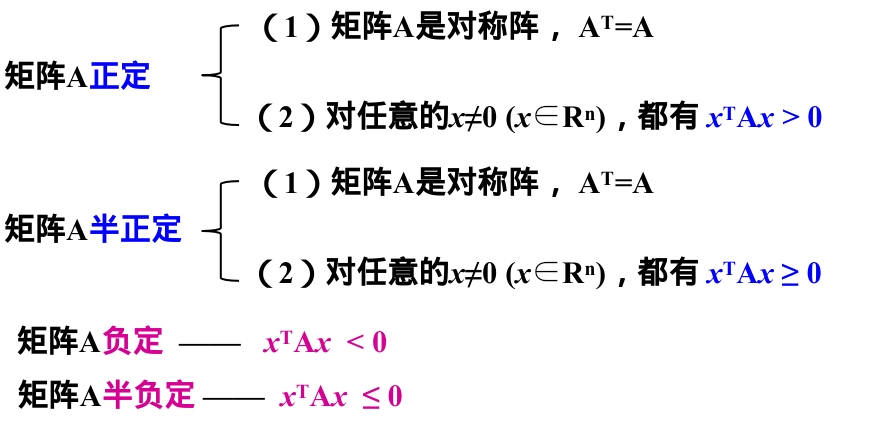

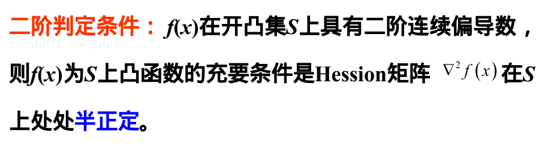

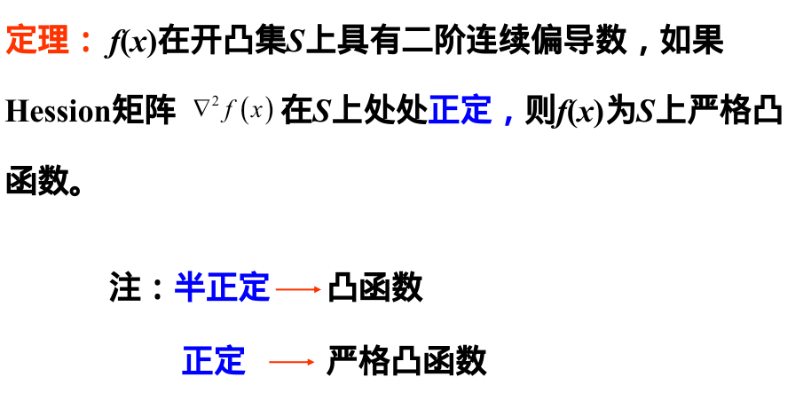

### 局部极小点和全局极小点

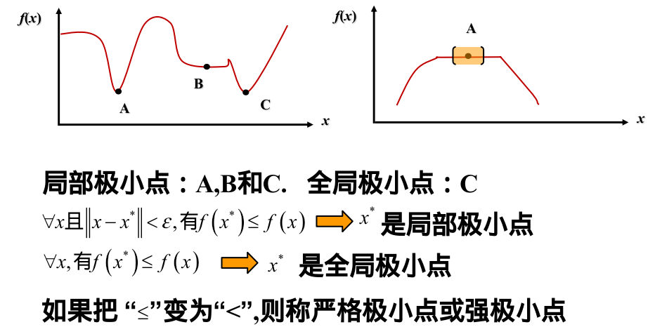

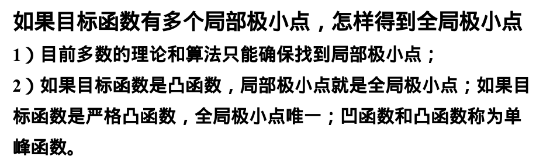

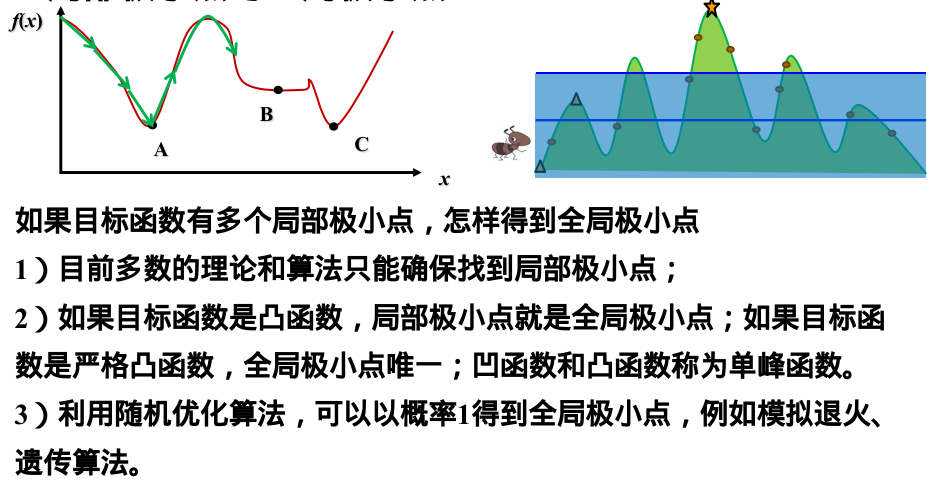

### 鞍点

#### （1）定义

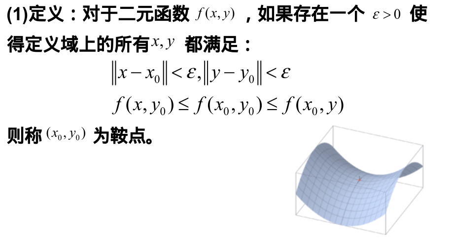

定义：对于二元函数$f(x, y)$，如果存在一个$\epsilon > 0$使得定义域上所有的$x, y$都满足：
1. $\vert \vert x - x_0 \vert \vert<\epsilon, \vert\vert y - y_0\vert\vert<\epsilon$
2. $f(x,y_0)\le f(x_0,y_0)\le f(x_0,y)$
则称$(x_0,y_0)$为鞍点。

#### （2）定理

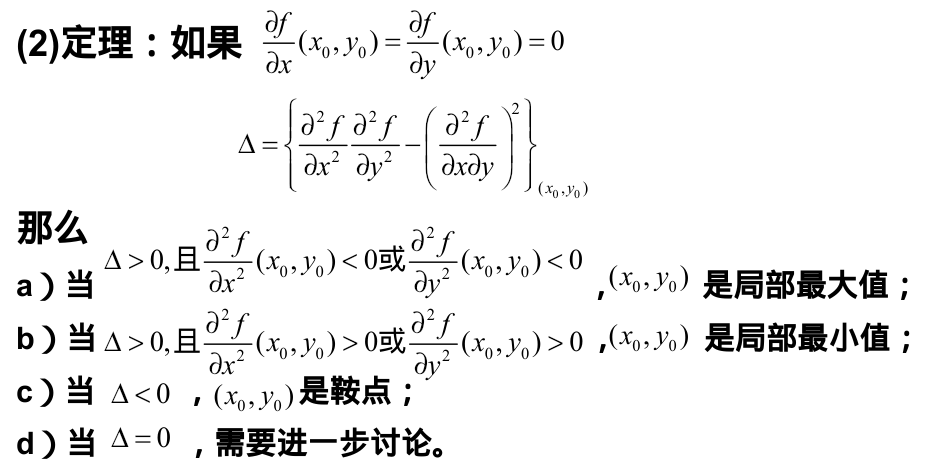

定理：如果:
1. $\frac{\partial f}{\partial x}(x_0,y_0)=\frac{\partial f}{\partial y}(x_0,y_0)=0$
2. $\Delta=\left \{ \frac{\partial ^ 2 f}{\partial x^2}\frac{\partial ^ 2 f}{\partial y^2}-\left( \frac{\partial ^ 2 f}{\partial x \partial y} \right)^2\right \}_{(x_0,y_0)}$

那么
1. 当$\Delta > 0$，且$\frac{\partial ^ 2 f}{\partial x^2}(x_0,y_0)<0$或$\frac{\partial ^ 2 f}{\partial y^2}(x_0,y_0)<0$，$x_0,y_0$是局部最大值。
2. 当$\Delta > 0$，且$\frac{\partial ^ 2 f}{\partial x^2}(x_0,y_0)>0$或$\frac{\partial ^ 2 f}{\partial y^2}(x_0,y_0)>0$，$x_0,y_0$是局部最小值。
3. 当$\Delta < 0$，$(x_0, y_0)$是鞍点
4. 当$\Delta = 0$，则需进一步讨论

### 优化的必要条件

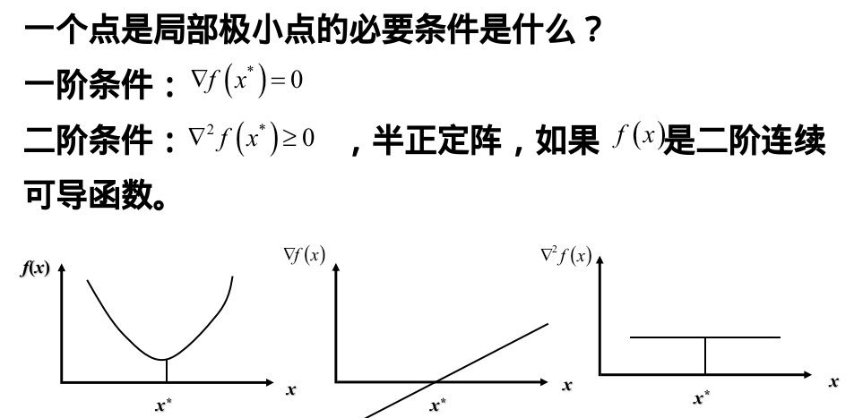
一个点是局部极小点的必要条件是什么？
- 一阶条件：$\nabla f(x^*) = 0$
- 二阶条件：$\nabla ^2 f(x^*) \ge 0$，半正定阵，如果$f(x)$是二阶连续可导函数。

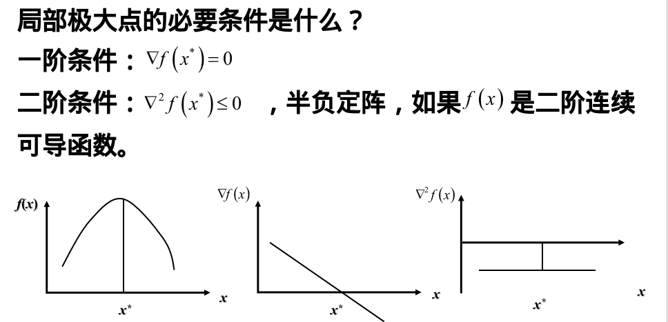
局部极大点的必要条件是什么？
- 一阶条件：$\nabla f(x^*) = 0$
- 二阶条件：$\nabla ^2 f(x^*) \le 0$，半负定阵，如果$f(x)$是二阶连续可导函数。

### 优化的充分条件

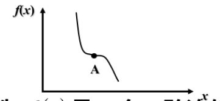

局部极小点的必要条件：$\nabla f(x^*) = 0$和$\nabla ^2 f(x^*) \ge0$它们是充分条件吗？不一定是。

充分条件：$f(x)$是一个二阶连续可微的函数，定义域是开集，如果$x^* \in S$，满足$\nabla f(x^*) = 0$和$\nabla f(x^*) > 0$，则$x^*$是严格的局部极小点。

满足必要条件不满足充分条件的点为奇异点，满足充分条件的点称为非奇异点。

如果一个可导的凸函数$f(x)$，其定义域$S$是开集，那么$x^*$是全局极小点的**充分条件**是$\nabla f(x^*) = 0$。
