# 一维优化算法

## 无约束优化问题的框架

无约束优化问题的关键就在两个地方：
1. 找到方向
2. 在对应方向上走一定的距离

而在对应的方向上走一定的距离其实就是一个一维优化的过程，
所以在无约束优化问题的学习之前先学习几个一维优化的方法。

## 一维优化方法

- 单峰函数：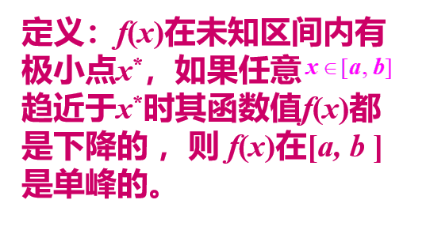
    - 如果不是单峰函数那么后面的方法都用不了，这里的单峰是指给定区间上是单峰的
- 基本思想：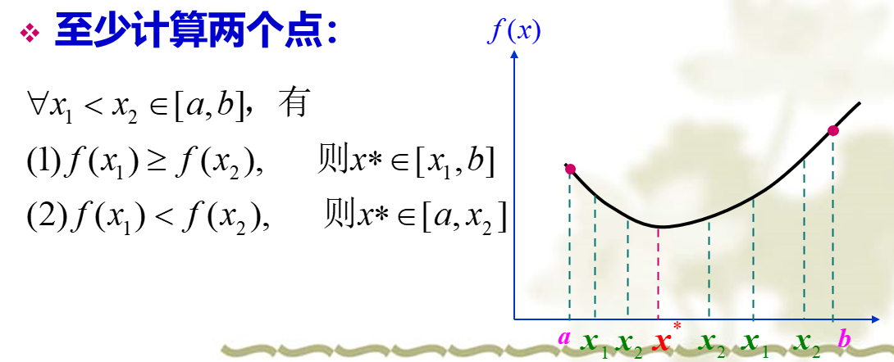

### 二分法

- 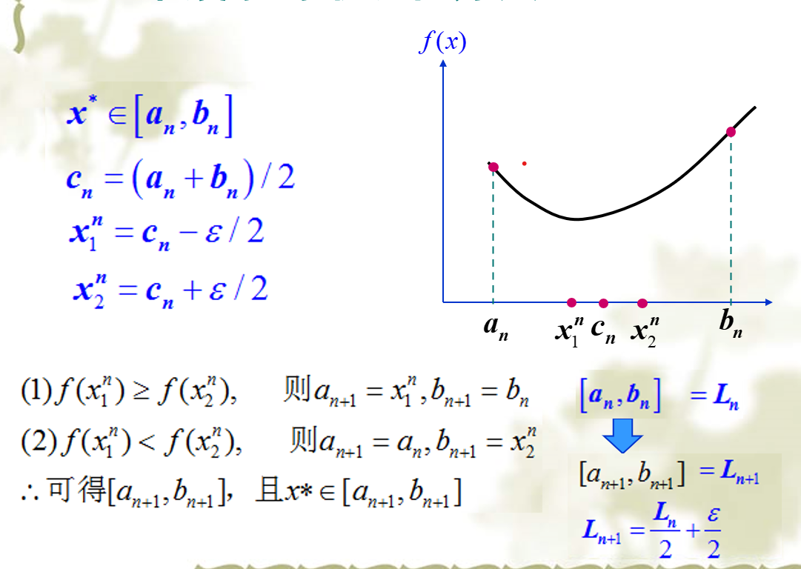

### 等分法

- 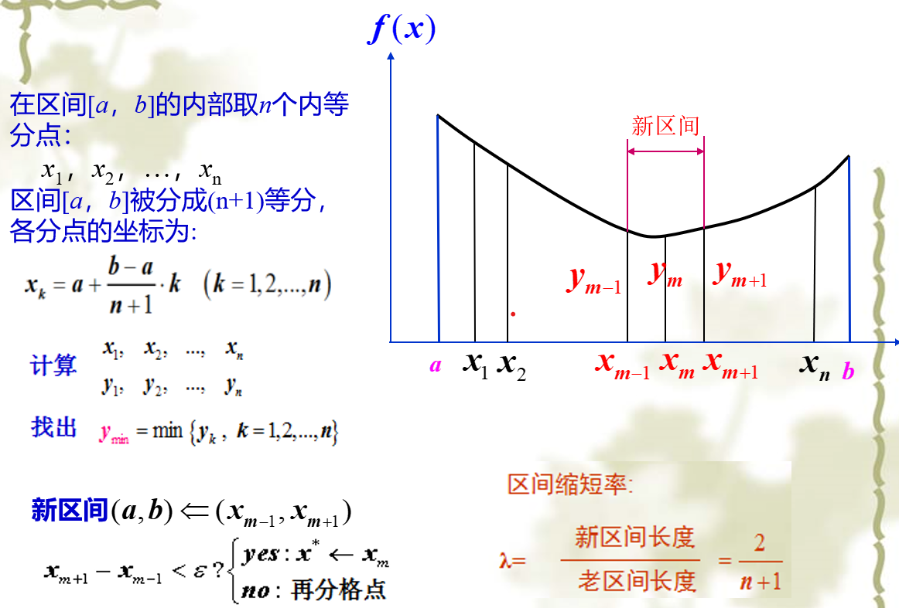
- 格点法一般用三个点把区间分成四分

### Fibonacci法

- 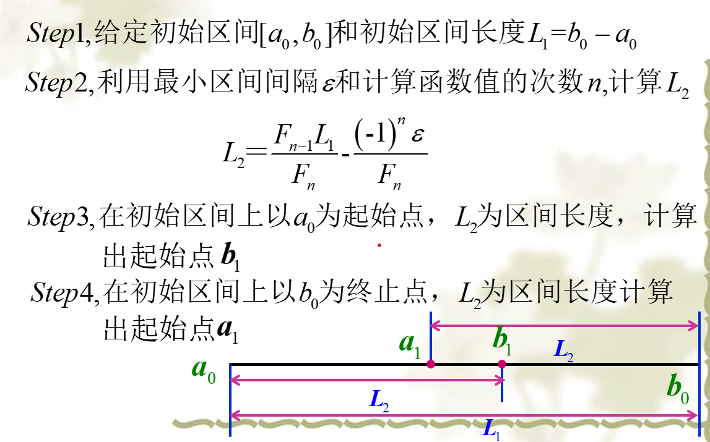
- 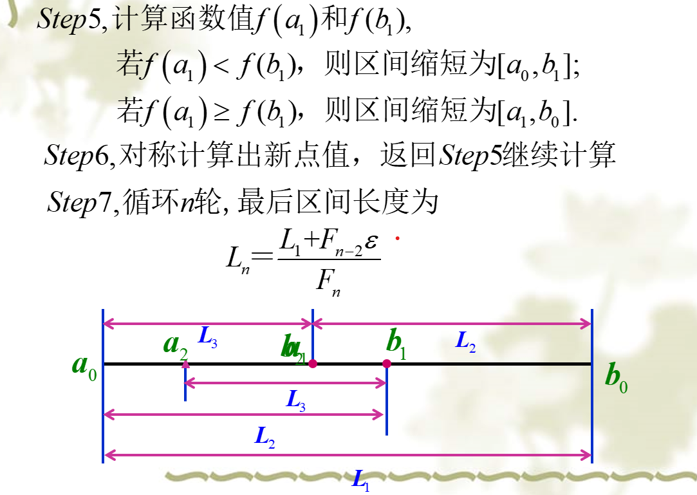
- 更正：L2公式中间是减号

### 黄金分割法

- 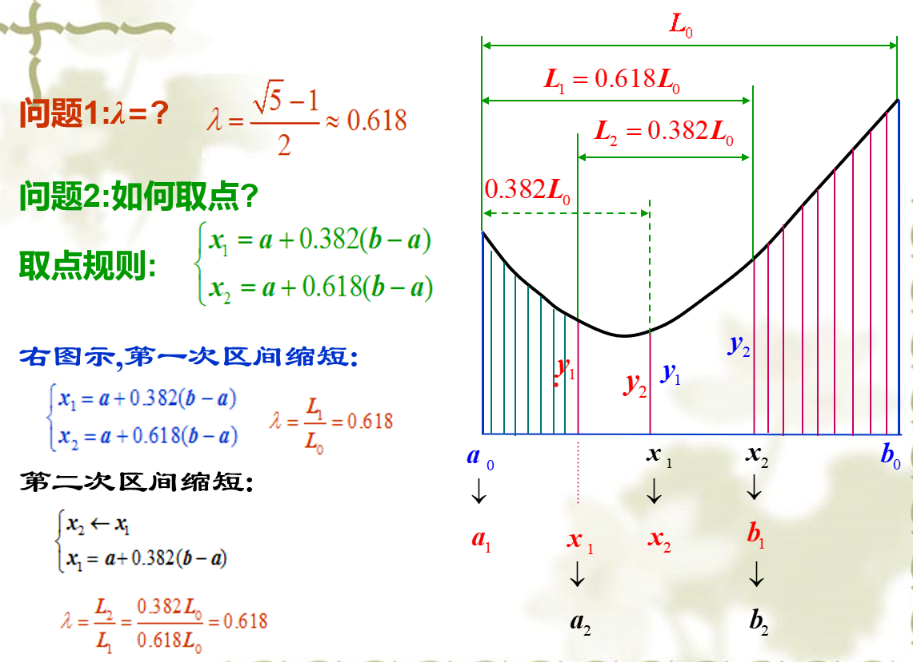
- 黄金分割法和Fibonacci法等其他每一轮都能用到上一轮计算结果的方法，一般上一轮中在左边的点，下一轮都在右边。

### 二次插值法

- 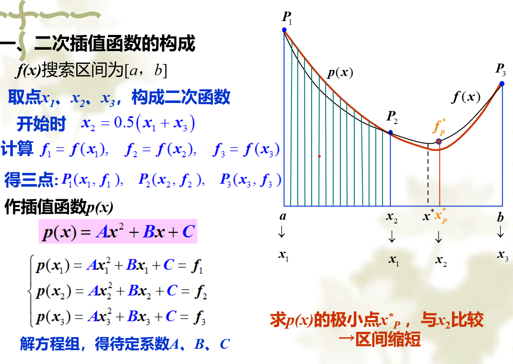
- 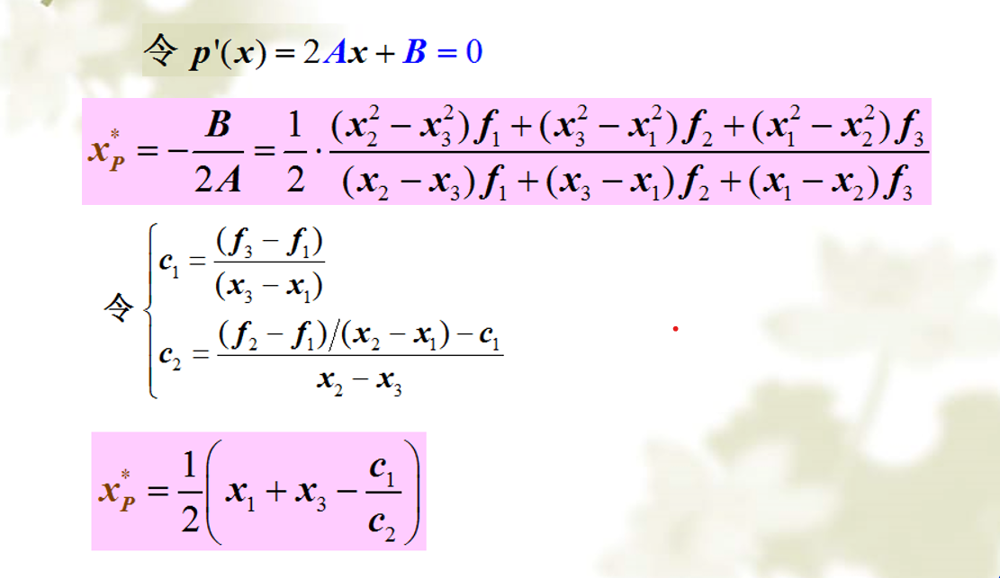
- 二次插值法的关键就在求出$x^p, f^p$

### 牛顿法

- 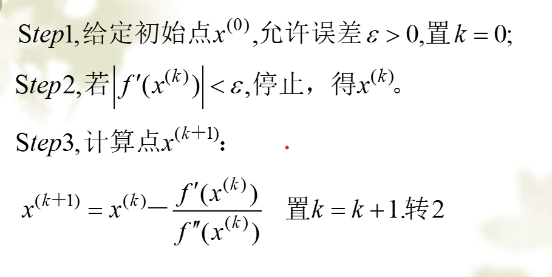
- 多元函数也有牛顿法，一元搜索的牛顿法可以看成多元的特例

### 小结

- 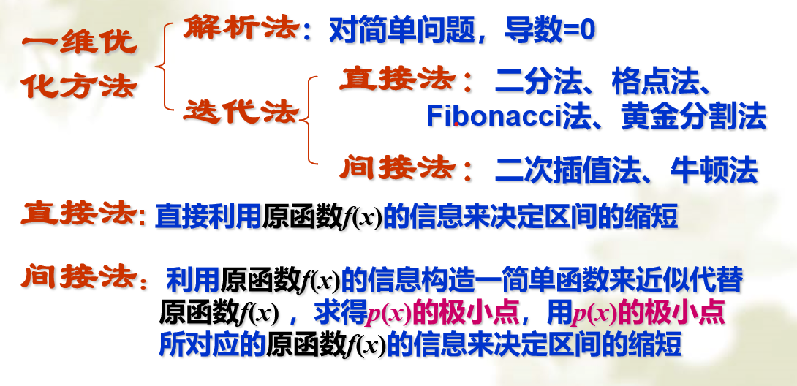
